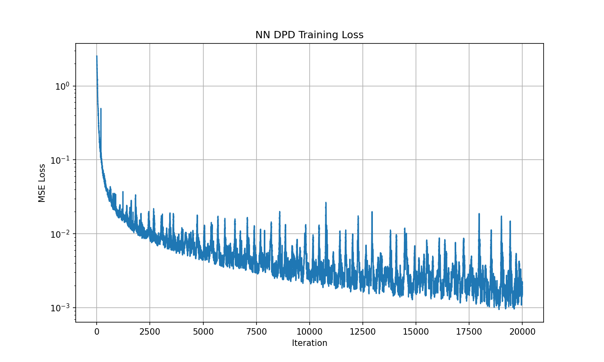

Digital Predistortion (DPD)
===========================

Overview
--------

This demo implements Digital Predistortion (DPD) for power amplifier (PA) linearization in 5G-like OFDM wireless systems. Power amplifiers are inherently nonlinear devices that introduce amplitude-dependent gain compression (AM/AM) and phase distortion (AM/PM), along with memory effects from thermal and electrical time constants. These nonlinearities cause spectral regrowth that violates adjacent channel leakage ratio (ACLR) specifications and in-band distortion that degrades error vector magnitude (EVM).

DPD compensates for PA nonlinearity by applying a pre-inverse transformation to the input signal such that the PA output becomes approximately linear. The demo implements two DPD approaches—Least-Squares (LS) DPD using the Memory Polynomial model and Neural Network (NN) DPD using a feedforward residual architecture—both trained via the indirect learning architecture where a postdistorter learns the PA inverse from its output.

.. image:: /_static/dpd/dpd_ila_architecture_light.svg
   :class: only-light
   :alt: DPD Indirect Learning Architecture

.. image:: /_static/dpd/dpd_ila_architecture_dark.svg
   :class: only-dark
   :alt: DPD Indirect Learning Architecture

System Architecture
-------------------

The DPD system operates on a single-user OFDM transmitter with 16-QAM modulation, rate-1/2 LDPC coding, and 624 active subcarriers across a 1024-point FFT with 15 kHz spacing. The baseband signal at 15.36 MHz is upsampled to the PA operating rate of 122.88 MHz (8× oversampling) using a polyphase rational resampler before predistortion and PA modeling.

The PA model (:class:`~demos.dpd.src.power_amplifier.PowerAmplifier`) implements a 7th-order Memory Polynomial with 4 memory taps, characterized from a WARP v3 board. The model captures both static nonlinearity and short-term memory effects using the structure:

.. math::

    y[n] = \sum_{k \in \{1,3,5,7\}} \sum_{m=0}^{3} a_{k,m} \cdot x[n-m] \cdot |x[n-m]|^{k-1}

Least-Squares DPD
^^^^^^^^^^^^^^^^^

The LS-DPD (:class:`~demos.dpd.src.ls_dpd.LeastSquaresDPD`) uses the same Memory Polynomial structure as the PA model but learns the inverse mapping. Coefficients are computed via closed-form least-squares estimation with Tikhonov regularization. The indirect learning architecture trains a postdistorter on the gain-normalized PA output, then copies these coefficients to the predistorter.

.. code-block:: python
   :caption: LS coefficient estimation (``ls_dpd.py:490-524``)

    def _ls_estimation(self, X, y):
        # Exclude edge samples affected by delays.
        start = self._memory_depth + self._lag_depth - 1
        end = -self._lag_depth if self._lag_depth > 0 else None
        X_slice, y_slice = X[start:end], tf.reshape(y[start:end], [-1, 1])

        # Regularized least-squares via TensorFlow's lstsq.
        return tf.linalg.lstsq(X_slice, y_slice, l2_regularizer=1e-3)

Neural Network DPD
^^^^^^^^^^^^^^^^^^

The NN-DPD (:class:`~demos.dpd.src.nn_dpd.NeuralNetworkDPD`) uses a feedforward architecture with residual blocks that can learn arbitrary nonlinear mappings beyond the polynomial model. The network processes sliding windows of complex samples (split into real/imaginary channels) through dense layers with layer normalization and PReLU activations.

.. image:: /_static/dpd/nn_dpd_architecture_light.svg
   :class: only-light
   :alt: Neural Network DPD Architecture

.. image:: /_static/dpd/nn_dpd_architecture_dark.svg
   :class: only-dark
   :alt: Neural Network DPD Architecture

The output layer is initialized to zeros, ensuring the initial network output equals the input (identity function via skip connection). This provides a stable starting point where training learns corrections relative to the pass-through behavior.

Training
--------

Both DPD methods are trained using the indirect learning architecture:

1. Generate OFDM signal and upsample to PA rate
2. Apply predistorter: :math:`u = \text{DPD}(x)`
3. Pass through PA: :math:`y = \text{PA}(u)`
4. Normalize by PA gain: :math:`y_{\text{norm}} = y / G`
5. Compute loss: :math:`\mathcal{L} = \|\text{DPD}(y_{\text{norm}}) - u\|^2`
6. Update DPD parameters

LS-DPD converges in 3–5 iterations using Newton-style updates with learning rate 0.75. NN-DPD requires 5,000–20,000 gradient descent iterations with Adam optimizer (learning rate 1e-3), using gradient accumulation over 4 mini-batches of size 16 for an effective batch size of 64.

Results
-------

Performance is measured using ACLR (adjacent channel power relative to main channel), NMSE (normalized mean squared error between ideal and actual PA output), and EVM (error vector magnitude). The following figures show the PSD comparison and constellation quality for both DPD methods.

   NN-DPD training loss convergence over 10,000 iterations.

.. figure:: ../../demos/dpd/results/ls_dpd_convergence.png
   :alt: LS-DPD Convergence
   :align: center
   :width: 80%

   LS-DPD coefficient convergence over 3 indirect learning iterations.

.. figure:: ../../demos/dpd/results/psd_comparison_ls.png
   :alt: PSD Comparison LS-DPD
   :align: center
   :width: 80%

   Power Spectral Density comparison: PA output without DPD, with LS-DPD, and ideal linear response.

.. figure:: ../../demos/dpd/results/psd_comparison_nn.png
   :alt: PSD Comparison NN-DPD
   :align: center
   :width: 80%

   Power Spectral Density comparison: PA output without DPD, with NN-DPD, and ideal linear response.

.. figure:: ../../demos/dpd/results/constellation_comparison_ls.png
   :alt: Constellation Comparison LS-DPD
   :align: center
   :width: 80%

   Received constellation comparison showing in-band distortion reduction with LS-DPD.

.. figure:: ../../demos/dpd/results/constellation_comparison_nn.png
   :alt: Constellation Comparison NN-DPD
   :align: center
   :width: 80%

   Received constellation comparison showing in-band distortion reduction with NN-DPD.

Both DPD methods significantly reduce spectral regrowth and improve ACLR by 15–25 dB compared to the uncompensated PA output. The LS-DPD achieves faster convergence due to its closed-form solution, while NN-DPD offers flexibility for PAs with behaviors that deviate from the polynomial model.

References
----------

- Morgan et al., "A Generalized Memory Polynomial Model for Digital Predistortion of RF Power Amplifiers," IEEE TSP, 2006
- Ding et al., "A Robust Digital Baseband Predistorter Constructed Using Memory Polynomials," IEEE TCOM, 2004
- Tarver et al., "Neural Network DPD via Backpropagation through a Neural Network Model of the PA," Asilomar, 2019