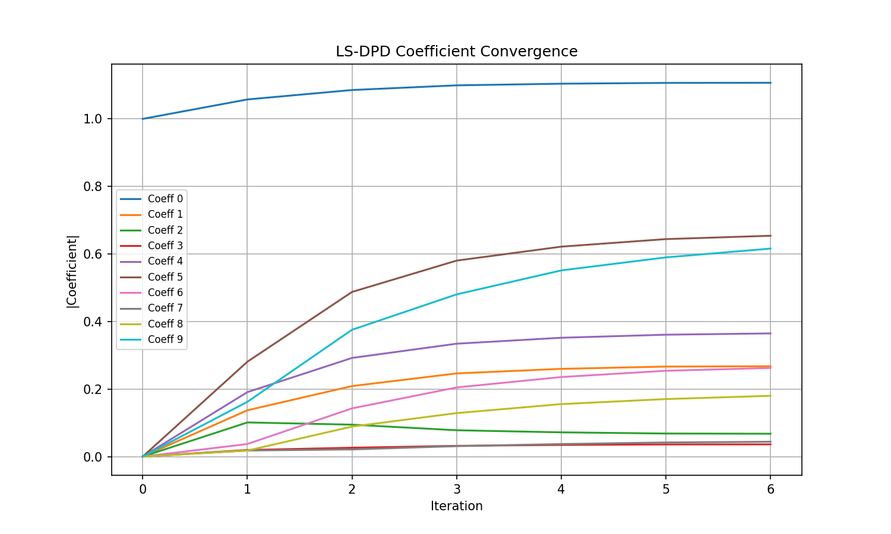
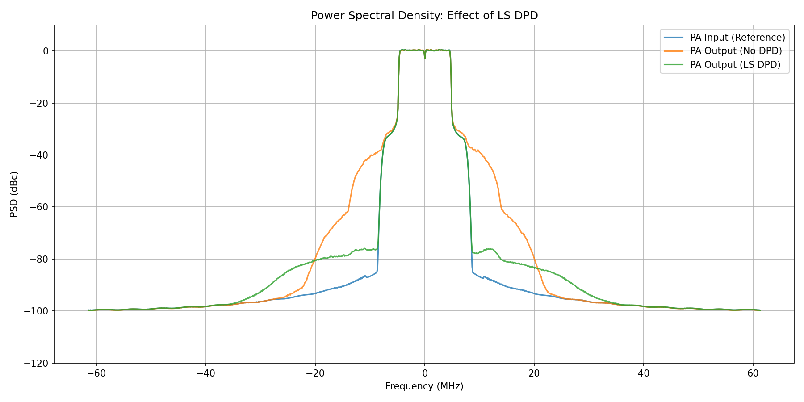
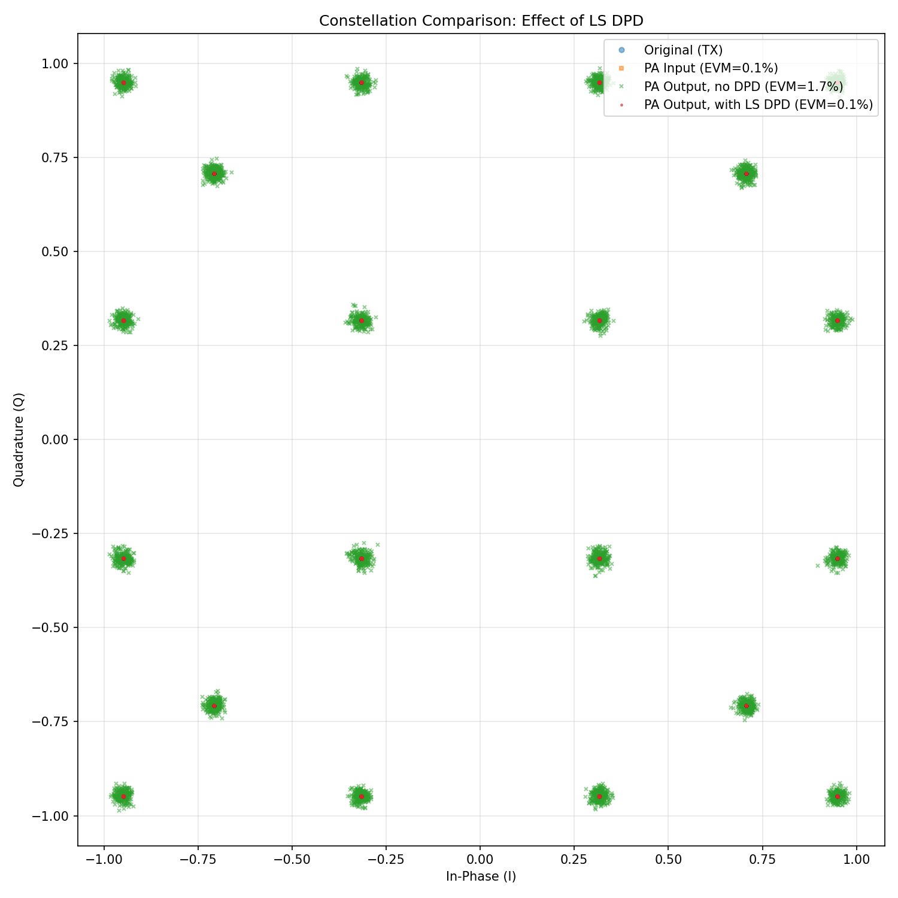
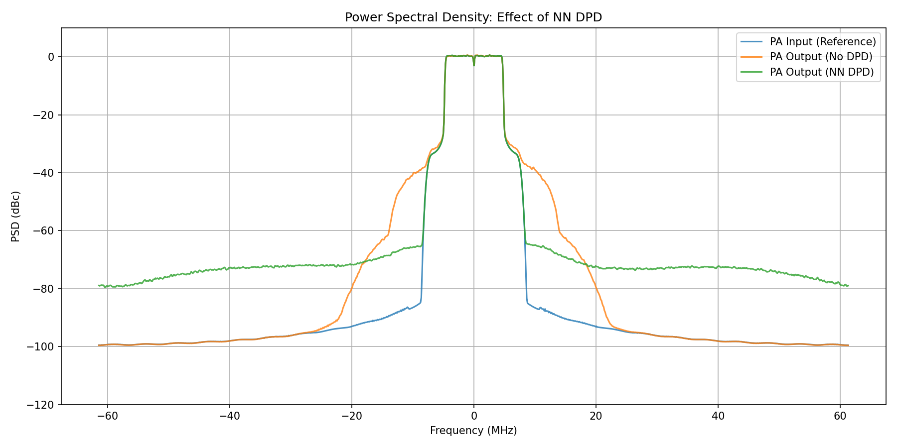
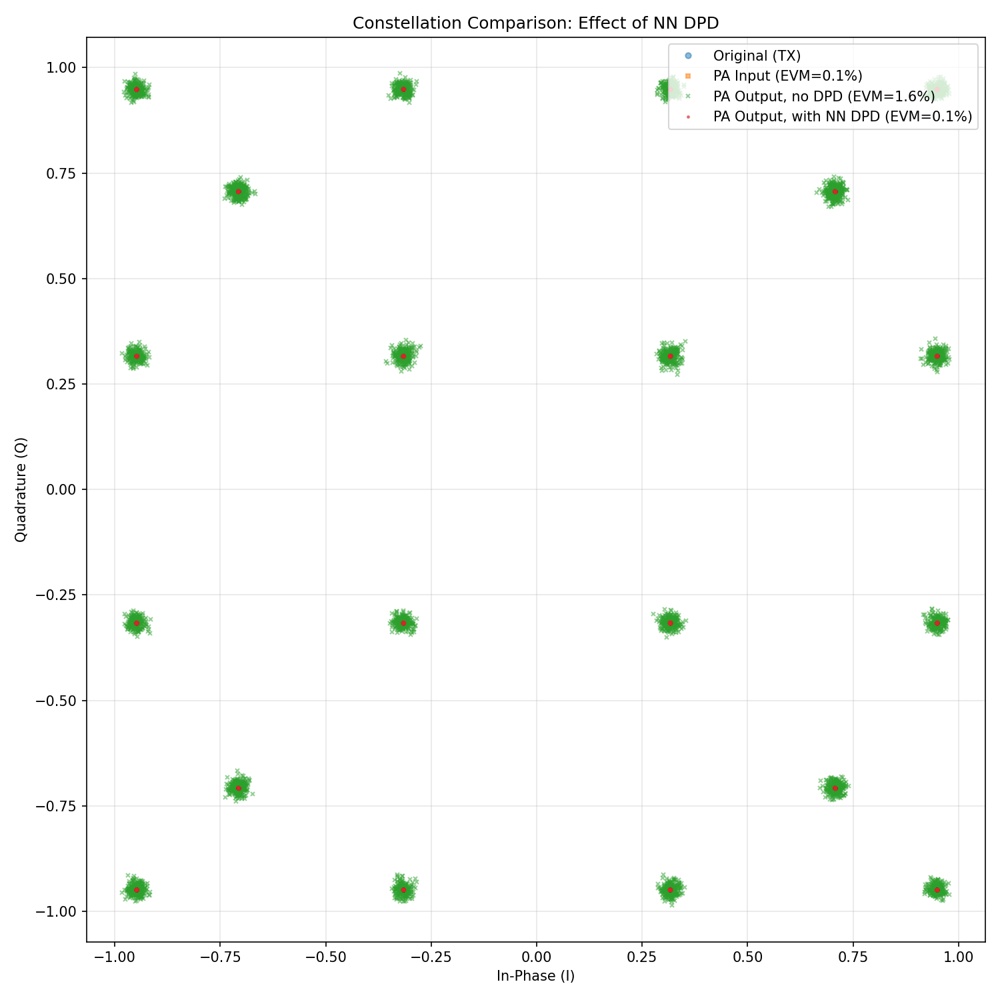

Digital Predistortion (DPD)
===========================

Overview
--------

This demo implements Digital Predistortion (DPD) for power amplifier (PA) linearization in 5G-like OFDM wireless systems. In this demo, the use of Sionna's API is limited only to generate the transmit signal used in DPD design. The subsequent demos utilize Sionna's features more extensively.

Power amplifiers are well-known to be inherently nonlinear devices that introduce amplitude-dependent gain compression (AM/AM) and phase distortion (AM/PM), along with memory effects from thermal and electrical time constants. These nonlinearities cause spectral regrowth that violates adjacent channel leakage ratio (ACLR) specifications and in-band distortion that degrades error vector magnitude (EVM). Mitigating these effects is important in order to meet spectral emission mask requirements set by regulatory bodies such as the Federal Communications Commission (FCC).

DPD compensates for PA nonlinearity by applying a pre-inverse transformation to the input signal such that the PA output becomes approximately linear. The demo implements two DPD approaches, namely Least-Squares (LS) DPD using the Memory Polynomial model and Neural Network (NN) DPD using a feedforward residual architecture, both trained via the indirect learning architecture (ILA).

System Architecture
-------------------

The DPD system operates on a single-user OFDM transmitter with 16-QAM modulation, rate-1/2 LDPC coding, and 624 active subcarriers across a 1024-point FFT with 15 kHz spacing. The baseband signal at 15.36 MHz is upsampled to the PA operating rate of 122.88 MHz (8x oversampling) using an interpolator before predistortion and PA modeling. For more details, see the code-snippet extracted from :class:`~demos.dpd.src.config.Config` below.

.. literalinclude:: ../../demos/dpd/src/config.py
   :language: python
   :start-after: # [phy-parameters-start]
   :end-before: # [phy-parameters-end]

PA Model
^^^^^^^^

The PA (:class:`~demos.dpd.src.power_amplifier.PowerAmplifier`) is modeled as a 7th-order Memory Polynomial with 4 memory taps, characterized from a WARP v3 board. The model captures both static nonlinearity and short-term memory effects using the structure:

.. math::

    y[n] = \sum_{k \in \{1,3,5,7\}} \sum_{m=0}^{3} a_{k,m} \cdot x[n-m] \cdot |x[n-m]|^{k-1}

Indirect Learning Architecture
^^^^^^^^^^^^^^^^^^^^^^^^^^^^^^

The indirect learning architecture (see diagram below) operates by exploiting the relationship between the desired PA output, the actual PA output, and the original input signal. During training, the post-distorter is learned first by mapping the PA output back to the pre-distorter output. The pre-distorter is then updated using these learned parameters, thereby driving the error toward zero. At convergence, the cascade of the pre-distorter and the PA behaves as a (nearly) linear system, with the signals at the inputs of the pre-distorter and post-distorter being identical. As a consequence, both blocks produce the same output and the resulting error signal vanishes.

.. image:: /_static/dpd/dpd_ila_architecture_light.svg
   :class: only-light
   :alt: DPD Indirect Learning Architecture

.. image:: /_static/dpd/dpd_ila_architecture_dark.svg
   :class: only-dark
   :alt: DPD Indirect Learning Architecture

The code snippet below from :meth:`~demos.dpd.src.nn_dpd_system.NN_DPDSystem._training_forward` of :class:`~demos.dpd.src.nn_dpd_system.NN_DPDSystem` implements the architecture diagram described for NN-DPD. The corresponding implementation for LS-DPD is similar (see :meth:`~demos.dpd.src.ls_dpd_system.LS_DPDSystem._ls_training_iteration` of :class:`~demos.dpd.src.ls_dpd_system.LS_DPDSystem`).

.. literalinclude:: ../../demos/dpd/src/nn_dpd_system.py
   :language: python
   :start-after: # [ila_architecture-start]
   :end-before:  # [ila_architecture-end]

Least-Squares DPD
^^^^^^^^^^^^^^^^^

The LS-DPD (:class:`~demos.dpd.src.ls_dpd.LeastSquaresDPD`) uses the same Memory Polynomial structure as the PA model. Coefficients are computed via closed-form least-squares estimation with regularization. The ILA trains a postdistorter on the gain-normalized PA output, then copies these coefficients to the pre-distorter.

.. literalinclude:: ../../demos/dpd/src/ls_dpd.py
   :language: python
   :start-after: # [ls-estimation-start]
   :end-before:  # [ls-estimation-end]

Neural Network DPD
^^^^^^^^^^^^^^^^^^

The NN-DPD (:class:`~demos.dpd.src.nn_dpd.NeuralNetworkDPD`) uses a feedforward architecture (see diagram below). 

.. image:: /_static/dpd/nn_dpd_architecture_light.svg
   :class: only-light
   :alt: Neural Network DPD Architecture

.. image:: /_static/dpd/nn_dpd_architecture_dark.svg
   :class: only-dark
   :alt: Neural Network DPD Architecture

This network processes sliding windows of complex samples (split into real/imaginary channels), and their envelopes raised to powers of 2, 4, and 6 through residual blocks encapsulated between input and output dense layers. The residual blocks follow the standard design which consists of cascaded units of layer normalization, activation function, and dense layer, with a skip connection to avoid gradient vanishing. The output layer is initialized to zeros, ensuring the initial network output equals the input (identity function via skip connection). This provides a stable starting point where training learns corrections relative to the pass-through behavior.

The input/output dense layers and the residual blocks are initialized as shown below:

.. literalinclude:: ../../demos/dpd/src/nn_dpd.py
   :language: python
   :start-after: # [nn-dpd-definition-start]
   :end-before:  # [nn-dpd-definition-end]

and the features are processed as shown below:

.. literalinclude:: ../../demos/dpd/src/nn_dpd.py
   :language: python
   :start-after: # [nn-dpd-call-start]
   :end-before:  # [nn-dpd-call-end]

Training
--------

Both DPD methods are trained using the ILA as described previously. To recap, an overview of the procedure followed is:

1. Generate OFDM signal and upsample to PA rate
2. Apply pre-distorter: :math:`u = \text{DPD}(x)`
3. Pass through PA: :math:`y = \text{PA}(u)`
4. Normalize by PA gain: :math:`y_{\text{norm}} = y / G`
5. Compute loss: :math:`\mathcal{L} = \|\text{DPD}(y_{\text{norm}}) - u\|^2`
6. Update DPD parameters

LS-DPD converges in 3-5 iterations using Newton-style updates with learning rate 0.75. 

NN-DPD was trained over 25000 gradient descent iterations with Adam optimizer (learning rate 1e-3). Gradient accumulation over 4 mini-batches of size 16 (for an effective batch size of 64) was implemented as follows:

.. literalinclude:: ../../demos/dpd/training_nn.py
   :language: python
   :start-after: # [nn-training-start]
   :end-before:  # [nn-training-end]

where, the graph-compiled gradient computation step was implemented as shown below:

.. literalinclude:: ../../demos/dpd/training_nn.py
   :language: python
   :start-after: # [nn-training-grad-compute-start]
   :end-before:  # [nn-training-grad-compute-end]

Results
-------

Performance is measured using ACLR (adjacent channel power relative to main channel), NMSE (normalized mean squared error between ideal and actual PA output), and EVM (error vector magnitude). 

LS-DPD
^^^^^^

LS-DPD coefficient convergence across 6 iterations using the Newton method for solving Linear Least Squares is shown below.

   LS-DPD coefficient convergence over 6 indirect learning iterations.

The power spectral density (PSD) plot below shows a clear mitigation of out-of-band spectral emissions indicating that non-linear effects of the PA have been mostly eliminated by the DPD.

   Power Spectral Density comparison: PA output without DPD, with LS-DPD, and ideal linear response.

Correspondingly, an analysis of the EVM with and without DPD reveals a clear improvement in the in-band performance.

   Received constellation comparison showing in-band distortion reduction with LS-DPD.

NN-DPD
^^^^^^

After training the NN-DPD for the desired number of iterations, running inference reveals the following performance improvement.

.. code-block:: bash

   ======================================================================
   NN DPD Inference
   ======================================================================

   [1] Building evaluation system with NN DPD...
      DPD parameters:  27586
      Estimated PA gain: 0.9705 (-0.26 dB)

   [2] Loading trained weights...
      Loaded weights from results/nn-dpd-weights

   [3] Running inference...
      Signal shape: (16, 70144)

   [4] Computing ACLR...
      ACLR (No DPD):   Lower = -35.35 dB, Upper = -34.84 dB
      ACLR (NN DPD):  Lower = -36.88 dB, Upper = -36.82 dB
      ACLR Improvement: 1.75 dB average

   [5] Computing NMSE...
      NMSE (No DPD):   -22.97 dB
      NMSE (NN DPD):  -56.99 dB
      NMSE Improvement: 34.02 dB

   [6] Saving PSD data...
      Saved to results/psd_data_nn.npz

   [7] Saving constellation data...
      Saved to results/constellation_data_nn.npz
      EVM (PA Input):  0.07%
      EVM (No DPD):    1.65%
      EVM (NN DPD):   0.09%

   ======================================================================
   Summary
   ======================================================================

   Metric                             No DPD          NN DPD     Improvement
   ----------------------------------------------------------------------
   ACLR Lower (dB)                    -35.35          -36.88            1.52
   ACLR Upper (dB)                    -34.84          -36.82            1.98
   NMSE (dB)                          -22.97          -56.99           34.02
   EVM (%)                              1.65            0.09            1.56
   ----------------------------------------------------------------------

The PSD plot for NN-DPD below also shows that out-of-band spectral emissions have been suppressed, although the performance improvement in suppressing fifth-order non-linearity is smaller compared to LS-DPD.

   Power Spectral Density comparison: PA output without DPD, with NN-DPD, and ideal linear response.

On the other hand, the improvement in EVM with and without NN-DPD reveals a comparable improvement similar to LS-DPD.

   Received constellation comparison showing in-band distortion reduction with NN-DPD.

In conclusion, both DPD methods significantly reduce spectral regrowth and improve ACLR compared to the uncompensated PA output. The LS-DPD achieves faster convergence due to its closed-form solution, but such a solution might not be always feasible when the basis matrix to be inverted is ill-conditioned. Conversely, NN-DPD, due to its gradient-based learning approach is not affected by such a disadvantage and also offers flexibility for PAs with behaviors that deviate from the polynomial model and due to its .

References
----------

- Morgan et al., "A Generalized Memory Polynomial Model for Digital Predistortion of RF Power Amplifiers," IEEE TSP, 2006
- Ding et al., "A Robust Digital Baseband pre-distorter Constructed Using Memory Polynomials," IEEE TCOM, 2004
- Tarver et al., "Neural Network DPD via Backpropagation through a Neural Network Model of the PA," Asilomar, 2019