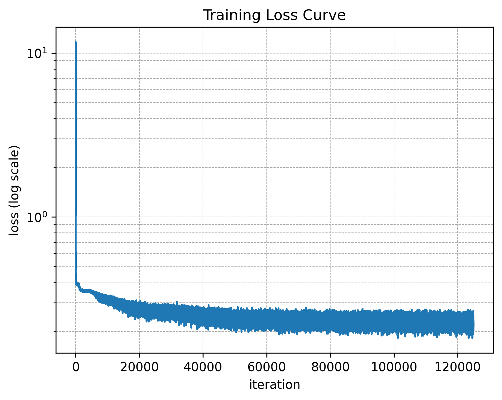

MIMO-OFDM Neural Receiver
=========================

Overview
--------

This demo implements a neural network-based receiver for MIMO-OFDM wireless communication systems using Sionna. Unlike the `NVIDIA Sionna Neural Receiver tutorial <https://nvlabs.github.io/sionna/phy/tutorials/Neural_Receiver.html>`_ which demonstrates a Single-Input Multiple-Output (SIMO) configuration, this implementation extends the concept to a full Multiple-Input Multiple-Output (MIMO) system with 4 transmit antennas at the user terminal and 8 receive antennas at the base station.

The neural receiver replaces the traditional receiver chain—channel estimation, equalization, and demapping—with a learned convolutional neural network that directly maps received signals and noise power estimates to Log-Likelihood Ratios (LLRs) for channel decoding. This end-to-end approach allows the network to jointly optimize these operations, potentially achieving better performance than the cascaded baseline, particularly under imperfect channel state information (CSI).

.. image:: /_static/neural_rx/neural_rx_mimo_ofdm_system_light.svg
   :class: only-light
   :alt: MIMO-OFDM Neural Receiver System

.. image:: /_static/neural_rx/neural_rx_mimo_ofdm_system_dark.svg
   :class: only-dark
   :alt: MIMO-OFDM Neural Receiver System

System Architecture
-------------------

The end-to-end system comprises four main components orchestrated by the :class:`~demos.mimo_ofdm_neural_receiver.src.system.System` class. The transmitter (:class:`~demos.mimo_ofdm_neural_receiver.src.tx.Tx`) generates random information bits, applies LDPC encoding, maps coded bits to QPSK symbols, and places them onto an OFDM resource grid. The :class:`~demos.mimo_ofdm_neural_receiver.src.channel.Channel` applies the frequency-selective fading channel and adds AWGN. The receiver—either the baseline :class:`~demos.mimo_ofdm_neural_receiver.src.rx.Rx` or the neural :class:`~demos.mimo_ofdm_neural_receiver.src.neural_rx.NeuralRx`—processes received signals to produce LLRs, which are then decoded by an LDPC decoder.

Channel realizations are generated by the :class:`~demos.mimo_ofdm_neural_receiver.src.csi.CSI` class using 3GPP CDL-C/D channel models. The CDL model, configured with a delay spread of 100–300 ns at 2.6 GHz carrier frequency, produces realistic frequency-selective fading appropriate for 5G NR evaluations.

Configuration
^^^^^^^^^^^^^

System parameters are centralized in the :class:`~demos.mimo_ofdm_neural_receiver.src.config.Config` dataclass. Key MIMO-OFDM parameters include a 4×8 antenna configuration (4 UT antennas, 8 BS antennas), a 76-point FFT with 15 kHz subcarrier spacing, 14 OFDM symbols per slot, and Kronecker pilot patterns at symbol indices 2, 5, 8, and 11. LDPC coding uses rate-1/2 with codeword length derived from the resource grid payload (see ``config.py:17-130``).

Neural Receiver
---------------

The neural receiver architecture, implemented in :class:`~demos.mimo_ofdm_neural_receiver.src.neural_rx.NeuralRx`, is a fully convolutional network inspired by the DeepRx architecture. The network processes the received resource grid as a 2D image where the spatial dimensions correspond to OFDM symbols (time) and subcarriers (frequency), with channels representing the real and imaginary parts of each receive antenna plus the noise power estimate.

.. image:: /_static/neural_rx/neural_rx_network_light.svg
   :class: only-light
   :alt: Neural Receiver Architecture

.. image:: /_static/neural_rx/neural_rx_network_dark.svg
   :class: only-dark
   :alt: Neural Receiver Architecture

The architecture consists of an input convolutional layer that projects the concatenated input features to 128 (or 512 during training) feature channels, followed by a stack of 4–12 residual blocks. Each :class:`~demos.mimo_ofdm_neural_receiver.src.neural_rx.ResidualBlock` contains layer normalization, ReLU activation, and 3×3 convolutions with skip connections. The output convolutional layer produces per-subcarrier LLRs for each stream and bit position, which are then reshaped and passed through a ``ResourceGridDemapper`` before LDPC decoding.

.. code-block:: python
   :caption: Residual block forward pass (``neural_rx.py:115-152``)

    def call(self, inputs):
        z = inputs
        for ln, conv in zip(self._layer_norms, self._convs):
            tf.debugging.assert_type(z, tf.float32)
            z = ln(z)
            z = relu(z)
            z = conv(z)
        # Skip connection: enables gradient flow and residual learning
        return z + inputs

Training
--------

Training minimizes binary cross-entropy (BCE) loss between the neural receiver's soft LLR outputs and the transmitted coded bits, bypassing LDPC encoding/decoding for gradient flow. The training loop (see ``training.py:72-122``) samples Eb/N0 uniformly from -3 dB to 7 dB for each batch, enabling the network to learn across the full SNR range simultaneously.

Gradient accumulation over 4 mini-batches of size 32 yields an effective batch size of 128, balancing memory constraints with gradient stability. The Adam optimizer with default learning rate is used. Checkpointing supports training resumption via the ``--iterations`` and ``--fresh`` command-line arguments. Training for 125,000 iterations produces the results shown below.

Results
-------

Performance is evaluated using Bit Error Rate (BER) and Block Error Rate (BLER) across Eb/N0 from -3 dB to 6 dB under the CDL-C channel model. The baseline receiver uses LS channel estimation with LMMSE equalization, tested under both perfect CSI (genie-aided) and imperfect CSI (estimated) conditions.

   Training loss over 125,000 iterations, showing convergence from initial BCE ~0.7 to final ~0.22.

.. figure:: ../../demos/mimo_ofdm_neural_receiver/results/ber_cdlC.png
   :alt: BER Comparison
   :align: center
   :width: 80%

   BER comparison under CDL-C channel: neural receiver vs. baseline with perfect/imperfect CSI.

.. figure:: ../../demos/mimo_ofdm_neural_receiver/results/bler_cdlC.png
   :alt: BLER Comparison
   :align: center
   :width: 80%

   BLER comparison under CDL-C channel: neural receiver vs. baseline with perfect/imperfect CSI.

The neural receiver significantly outperforms the baseline with imperfect CSI, particularly at mid-to-high SNR where channel estimation errors dominate baseline performance. At 6 dB Eb/N0, the neural receiver achieves approximately 4× lower BER than the imperfect-CSI baseline. However, the neural receiver does not yet match the perfect-CSI baseline, indicating room for architectural improvements such as attention mechanisms or increased model capacity.

References
----------

- Honkala et al., "DeepRx: Fully Convolutional Deep Learning Receiver," IEEE TCCN, 2021
- Sionna Neural Receiver Tutorial: https://nvlabs.github.io/sionna/phy/tutorials/Neural_Receiver.html
- 3GPP TR 38.901: Channel model for frequencies from 0.5 to 100 GHz