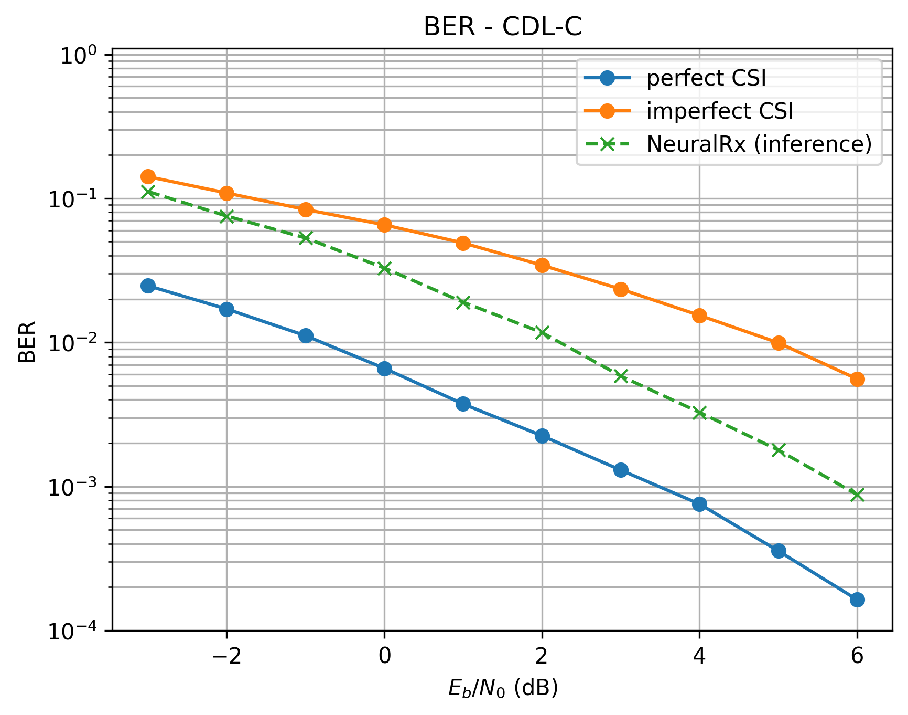
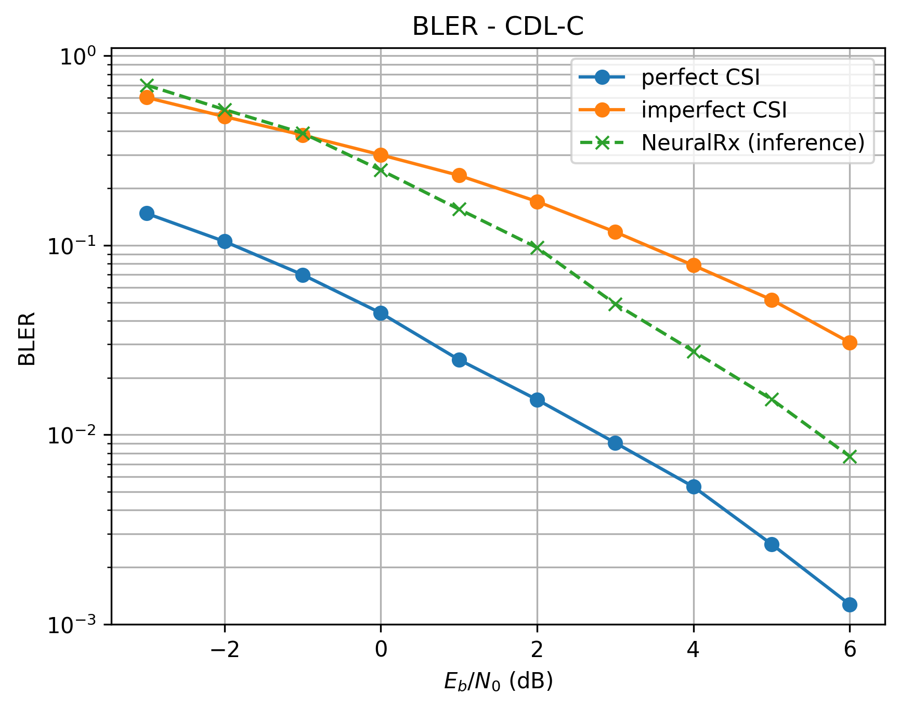

MIMO-OFDM Neural Receiver
=========================

Overview
--------

This demo implements a neural network-based receiver for MIMO-OFDM wireless communication systems using Sionna. It is a simple extension of the `Neural Receiver for OFDM SIMO Systems <https://nvlabs.github.io/sionna/phy/tutorials/Neural_Receiver.html>`_  tutorial which demonstrates a Single-Input Multiple-Output (SIMO) system, by considering a Multiple-Input Multiple-Output (MIMO)-OFDM system with 4 transmit antennas and 8 receive antennas.

The neural receiver replaces the traditional receiver chain, namely channel estimation, equalization, and demapping, with a learned convolutional neural network that directly maps received signals and noise power estimates to Log-Likelihood Ratios (LLRs) for channel decoding. This end-to-end approach allows the network to jointly optimize these operations, potentially achieving better performance than the baseline receiver, particularly under imperfect channel state information (CSI).

System Architecture
-------------------

The end-to-end system (see diagram below) is architected by the :class:`~demos.mimo_ofdm_neural_receiver.src.system.System` class, and the architecture diagram depicting this class is shown below.

.. image:: /_static/neural_rx/neural_rx_mimo_ofdm_system_light.svg
   :class: only-light
   :alt: MIMO-OFDM Neural Receiver System

.. image:: /_static/neural_rx/neural_rx_mimo_ofdm_system_dark.svg
   :class: only-dark
   :alt: MIMO-OFDM Neural Receiver System

It utilizes the configuration defined in :class:`~demos.mimo_ofdm_neural_receiver.src.config.Config` to enforce a single, validated system configuration. See the code-snippet extracted from :class:`~demos.mimo_ofdm_neural_receiver.src.config.Config` below for more details.

.. literalinclude:: ../../demos/mimo_ofdm_neural_receiver/src/config.py
   :language: python
   :start-after: # [phy-parameters-start]
   :end-before: # [phy-parameters-end]

:class:`~demos.mimo_ofdm_neural_receiver.src.tx.Tx` class generates random information bits, applies LDPC encoding, maps coded bits to QPSK symbols, and places them onto an OFDM resource grid with 14 OFDM symbols per slot, a 15 kHz subcarrier spacing, and an FFT size of 76. :class:`~demos.mimo_ofdm_neural_receiver.src.csi.CSI` class generates the frequency-domain CDL channel for the 4x8 MIMO link with the desired delay spread, carrier frequency, mobility, and propagation scenario by first configuring dual cross-polarized transmit and receive antenna arrays according to 3GPP TR 38.901, then generating delay-domain channel impulse responses (CIRs), and finally converting them into normalized frequency-domain channel coefficients consistent with the resource grid. :class:`~demos.mimo_ofdm_neural_receiver.src.rx.Rx`, the baseline receiver class, processes received signals by first obtaining channel estimates, then utilizing them to perform equalization, followed by demapping to produce LLRs, which are finally decoded by an LDPC decoder.

Neural Receiver
---------------

The neural receiver architecture (see diagram below), implemented in :class:`~demos.mimo_ofdm_neural_receiver.src.neural_rx.NeuralRx`, is a convolutional network that processes the received resource grid as a 2D image where the spatial dimensions correspond to OFDM symbols (time) and subcarriers (frequency), with channels representing the real and imaginary parts of each receive antenna plus the noise power estimate.

.. image:: /_static/neural_rx/neural_rx_network_light.svg
   :class: only-light
   :alt: Neural Receiver Architecture

.. image:: /_static/neural_rx/neural_rx_network_dark.svg
   :class: only-dark
   :alt: Neural Receiver Architecture

The architecture consists of an input convolutional layer that projects the concatenated input features to 256 feature channels, cascaded by 4 residual blocks (:class:`~demos.mimo_ofdm_neural_receiver.src.neural_rx.ResidualBlock`), each built from stacking two cascaded units of layer normalization, activation function, and convolutional layer, with a skip connection to avoid gradient vanishing. The output convolutional layer produces per-subcarrier LLRs for each stream and bit position, which are then reshaped and passed through a resource-grid demapper before LDPC decoding.

The input/output layers and the residual blocks are initialized as shown below:

.. literalinclude:: ../../demos/mimo_ofdm_neural_receiver/src/neural_rx.py
   :language: python
   :start-after: # [neural_rx-definition-start]
   :end-before:  # [neural_rx-definition-end]

and the features are processed as shown below:

.. literalinclude:: ../../demos/mimo_ofdm_neural_receiver/src/neural_rx.py
   :language: python
   :start-after: # [neural_rx-call-start]
   :end-before:  # [neural_rx-call-end]

Training
--------

Training minimizes binary cross-entropy (BCE) loss between the neural receiver's soft LLR outputs and the transmitted coded bits, bypassing LDPC encoding/decoding for gradient flow. The training loop (see ``training.py:72-122``) samples Eb/N0 uniformly from -3 dB to 7 dB for each batch, enabling the network to learn across the full SNR range simultaneously.

Gradient accumulation over 4 mini-batches of size 32 yields an effective batch size of 128, balancing memory constraints with gradient stability. The Adam optimizer with default learning rate is used. Checkpointing supports training resumption via the ``--iterations`` and ``--fresh`` command-line arguments. The core of the training logic is shown below:

.. literalinclude:: ../../demos/mimo_ofdm_neural_receiver/training.py
   :language: python
   :start-after: # [training-core-start]
   :end-before:  # [training-core-end]

Results
-------

Performance is evaluated using Bit Error Rate (BER) and Block Error Rate (BLER) across Eb/N0 from -3 dB to 6 dB under the CDL-C channel model. The baseline receiver uses LS channel estimation with LMMSE equalization, tested under both perfect CSI and imperfect CSI (estimated) conditions.

   BER comparison under CDL-C channel: neural receiver vs. baseline with perfect/imperfect CSI.

   BLER comparison under CDL-C channel: neural receiver vs. baseline with perfect/imperfect CSI.

The neural receiver significantly outperforms the baseline with imperfect CSI, particularly at mid-to-high SNR where channel estimation errors dominate baseline performance. At 6 dB Eb/N0, the neural receiver achieves approximately 4x lower BER than the imperfect-CSI baseline. However, the neural receiver does not yet match the perfect-CSI baseline, indicating room for architectural improvements such as attention mechanisms or increased model capacity.

References
----------

- Honkala et al., "DeepRx: Fully Convolutional Deep Learning Receiver," IEEE TCCN, 2021
- Sionna Neural Receiver Tutorial: https://nvlabs.github.io/sionna/phy/tutorials/Neural_Receiver.html
- 3GPP TR 38.901: Channel model for frequencies from 0.5 to 100 GHz