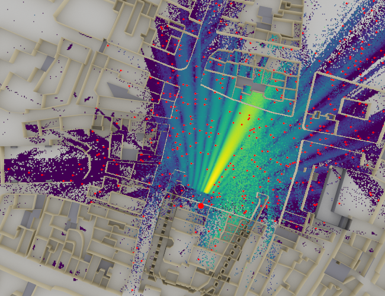
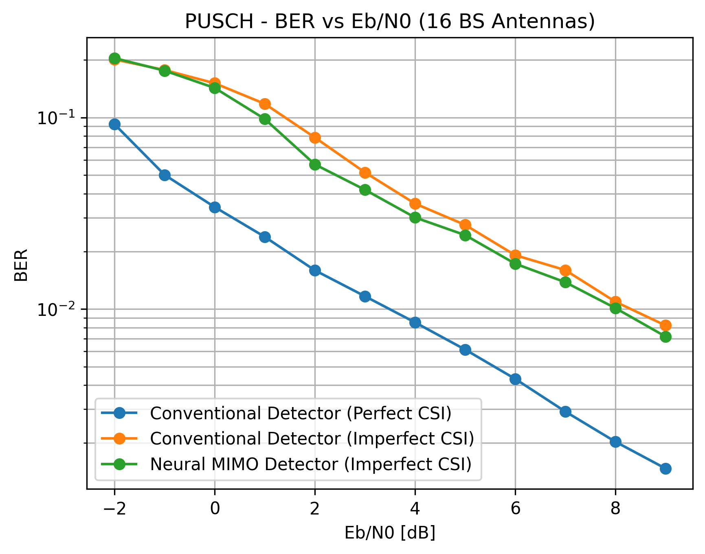
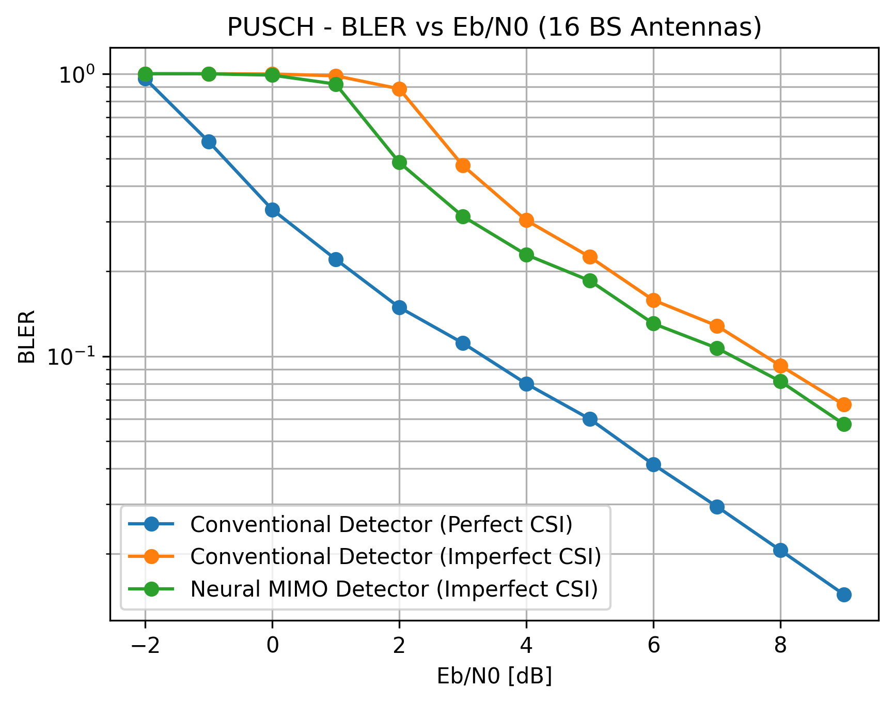
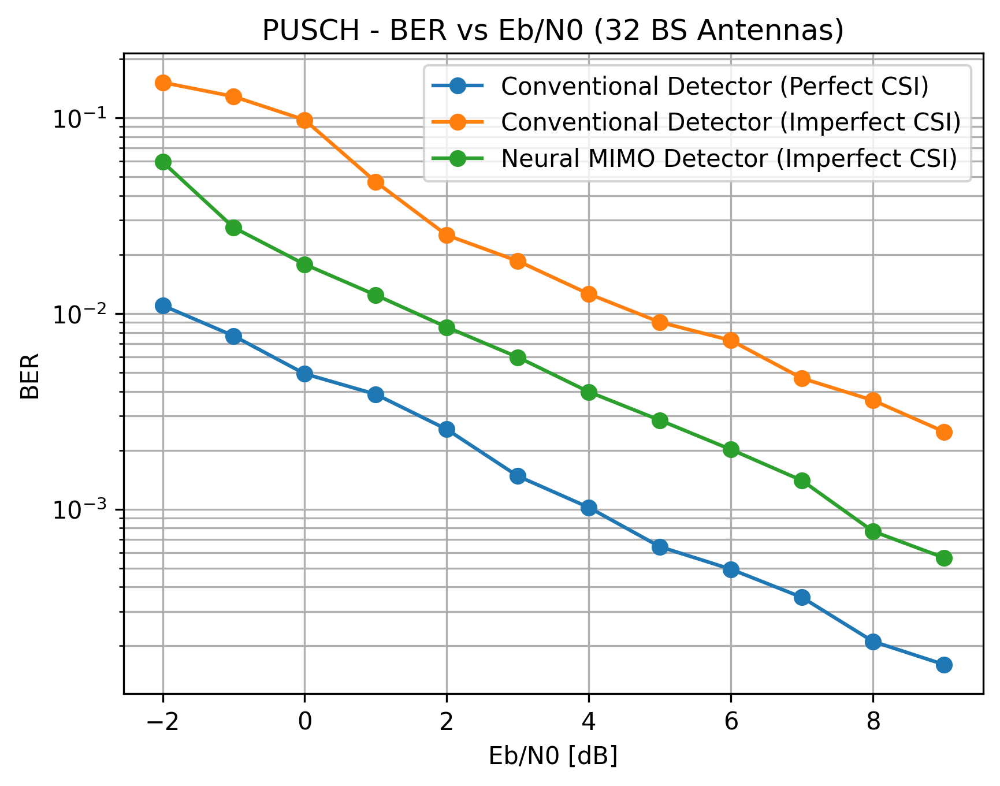
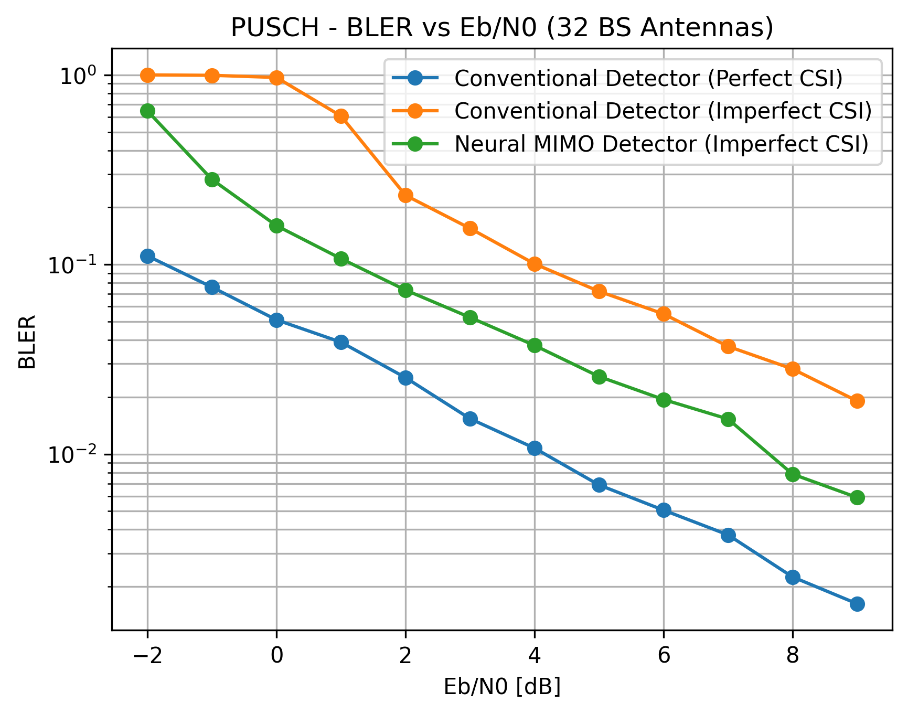
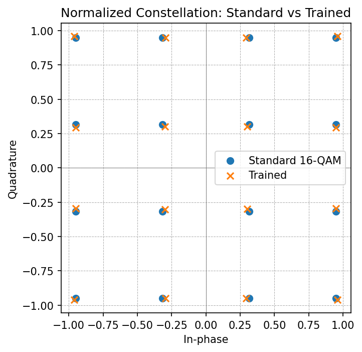

Site-Specific PUSCH Autoencoder
===============================

Overview
--------

This demo implements an end-to-end autoencoder for the 5G NR Physical Uplink Shared Channel (PUSCH), by jointly optimizing a trainable constellation at the transmitter and a neural MIMO detector at the receiver [1]. The system operates over site-specific ray-traced channels derived from a realistic Munich urban environment, enabling the autoencoder to adapt to the propagation characteristics of this specific deployment.

The autoencoder applies concepts from classical communication autoencoders (O'Shea & Hoydis, 2017) to a multi-user MIMO uplink scenario with 4 UEs (each with 4 antennas) transmitting to a base station with 16 or 32 antennas. This demo builds upon the following Sionna tutorials: 

- `5G NR PUSCH Tutorial <https://nvlabs.github.io/sionna/phy/tutorials/5G_NR_PUSCH.html>`_, 
- `Link-level simulations with Sionna RT <https://nvlabs.github.io/sionna/phy/tutorials/Link_Level_Simulations_with_RT.html>`_, and 
- `End-to-end Learning with Autoencoders <https://nvlabs.github.io/sionna/phy/tutorials/Autoencoder.html>`_.

System Architecture
-------------------

The PUSCH link (:class:`~demos.pusch_autoencoder.src.system.PUSCHLinkE2E`) implements a complete uplink chain. 
The architecture diagram depicting this class is shown below.

.. image:: /_static/pusch_autoencoder/pusch_autoencoder_light.svg
   :class: only-light
   :alt: PUSCH Autoencoder System Architecture

.. image:: /_static/pusch_autoencoder/pusch_autoencoder_dark.svg
   :class: only-dark
   :alt: PUSCH Autoencoder System Architecture

For details regarding the OFDM slot structure, the MIMO configuration, and the 5G NR PUSCH parameters used in this demo, see the code-snippet extracted from :class:`~demos.pusch_autoencoder.src.config.Config` below.

.. literalinclude:: ../../demos/pusch_autoencoder/src/config.py
   :language: python
   :start-after: # [phy-parameters-start]
   :end-before: # [phy-parameters-end]

Trainable Transmitter
^^^^^^^^^^^^^^^^^^^^^
The transmitter (:class:`~demos.pusch_autoencoder.src.pusch_trainable_transmitter.PUSCHTrainableTransmitter`) subclasses Sionna's ``PUSCHTransmitter`` with learnable constellation points. The sequence of operations implemented are as follows. First, information bits are encoded into a transport block, which are then mapped to QAM constellation symbols by the Mapper. The constellation points are initialized to 16-QAM points. They are set to be trainable when the autoencoder is being designed, and non-trainable when evaluating the baseline scenarios. Next, the modulated symbols are split into different layers which are then mapped onto OFDM resource grids. If precoding is enabled, the resource grids are further precoded so that there is one for each transmitter and antenna port, and these are the outputs of the transmit chain.

The steps involved in setting up the custom constellation are shown in the code-snippet below (extracted from :class:`~demos.pusch_autoencoder.src.pusch_trainable_transmitter.PUSCHTrainableTransmitter`).

.. literalinclude:: ../../demos/pusch_autoencoder/src/pusch_trainable_transmitter.py
   :language: python
   :start-after: # [custom-constellation-start]
   :end-before: # [custom-constellation-end]

Trainable Receiver
^^^^^^^^^^^^^^^^^^
The receiver implements a hybrid classical/neural-network architecture. The sequence of operations implemented are as follows. First, channel estimation is performed. If channel_estimator is chosen to be “perfect”, this step is skipped and the perfect channel state information (CSI) is used downstream. Next, MIMO detection is carried out with an LMMSE Detector. The resulting LLRs for each layer are then combined to transport blocks and are decoded.

The only modification in the subclassed trainable receiver (:class:`~demos.pusch_autoencoder.src.pusch_trainable_receiver.PUSCHTrainableReceiver`) is the provision to choose between a classical LMMSE detector versus the neural-network based detector:

.. literalinclude:: ../../demos/pusch_autoencoder/src/pusch_trainable_receiver.py
   :language: python
   :start-after: # [detector-selection-start]
   :end-before: # [detector-selection-end]

Neural Detector
"""""""""""""""

The neural detector (:class:`~demos.pusch_autoencoder.src.pusch_neural_detector.PUSCHNeuralDetector`) implements a residual learning architecture that refines LS channel estimates and LMMSE soft symbols rather than learning detection from scratch. The motivation behind this design is that learning residual corrections to classical estimates is more stable than learning detection from scratch. The architecture (see diagram below) processes shared features through convolutional residual blocks to obtain channel estimation refinement before proceeding to refine LLR through MIMO-OFDM detection head. Note that while the conventional LS channel estimation relies exclusively on the pilot symbols, the channel estimation refinement additionally utilizes data symbols also.

.. image:: /_static/pusch_autoencoder/pusch_autoencoder_neural_detector_toplevel_light.svg
   :class: only-light
   :alt: Neural Detector Top-Level Architecture

.. image:: /_static/pusch_autoencoder/pusch_autoencoder_neural_detector_toplevel_dark.svg
   :class: only-dark
   :alt: Neural Detector Top-Level Architecture

Three trainable correction scales control how much the neural network deviates from classical LS channel estimation followed by LMMSE MIMO-OFDM detection. These scales start at zero (pure classical behavior) and are learned during training, providing interpretable indicators of where neural refinement helps most.

The initialization of various components in the shared backbone, the channel estimation refinement head, and the MIMO-OFDM detection head are as shown below:

.. literalinclude:: ../../demos/pusch_autoencoder/src/pusch_neural_detector.py
   :language: python
   :start-after: # [autoencoder-definition-start]
   :end-before:  # [autoencoder-definition-end]

The features are processed by the shared backbone network as shown below:

.. literalinclude:: ../../demos/pusch_autoencoder/src/pusch_neural_detector.py
   :language: python
   :start-after: # [shared-backbone-start]
   :end-before:  # [shared-backbone-end]

by the channel estimation head as shown below:

.. literalinclude:: ../../demos/pusch_autoencoder/src/pusch_neural_detector.py
   :language: python
   :start-after: # [ce-head-start]
   :end-before:  # [ce-head-end]

and by the MIMO-OFDM detection head as shown below:

.. literalinclude:: ../../demos/pusch_autoencoder/src/pusch_neural_detector.py
   :language: python
   :start-after: # [det-head-start]
   :end-before:  # [det-head-end]
   
The residual blocks follow the standard design which consists of cascaded units of layer normalization, activation function, and convolutional layer, with a skip connection to avoid gradient vanishing.

.. image:: /_static/pusch_autoencoder/pusch_autoencoder_res_block_light.svg
   :class: only-light
   :alt: Residual Block Architecture

.. image:: /_static/pusch_autoencoder/pusch_autoencoder_res_block_dark.svg
   :class: only-dark
   :alt: Residual Block Architecture

Ray-traced Channel
^^^^^^^^^^^^^^^^^^
Sionna-RT module can be used simulate environment-specific and physically accurate channel realizations for a given scene and user position. It is built on top of `Mitsuba 3 <https://www.mitsuba-renderer.org/>`_.

Setting up the ray tracer
"""""""""""""""""""""""""
The ray-traced channel generated using Sionna-RT consists of a single-cell, multiuser MIMO layout with one base station serving four users, equipped with 16 (or 32) antennas and 4 antennas, respectively, using planar arrays with half-wavelength element spacing and cross polarization. An integrated urban scene located in Munich is loaded and the base station is placed at ``[8.5, 21, 27]``, with its orientation fixed toward the service area, while a static camera at ``[0, 80, 500]`` is used to generate verification renders. Propagation is computed deterministically with a maximum interaction depth of 5, spatial resolution cell size of (1.0, 1.0), and samples per transmitter set to 10000, producing a dense radio map of path gain across the environment. For more details see the code-snippet extracted from :class:`~demos.pusch_autoencoder.src.config.Config` below.

.. literalinclude:: ../../demos/pusch_autoencoder/src/config.py
   :language: python
   :start-after: # [rt-parameters-start]
   :end-before: # [rt-parameters-end]

The rendered figure below visualizes this radio map overlaid on the scene geometry, and shows the transmitter placement, the dominant propagation regions, and the obstruction effects prior to receiver sampling. Although the focus is geometric, the physical-layer context is fixed via a subcarrier spacing of 30 kHz and num_time_steps = 14, which later determine the temporal resolution of the channel representation.

   Ray-traced Munich urban scene showing sampled UE positions for CIR generation.

Creating a CIR dataset
""""""""""""""""""""""
Receiver positions are sampled in batches of 500 from the radio map using path-gain constraints (-130 dB to 0 dB) and a distance window of 5-400 m around the base station, ensuring physically meaningful links. For each batch, all receivers are updated in the scene and multipath propagation is recomputed with up to 10000 paths per transmitter, preserving line-of-sight and higher-order interactions up to the specified depth. Continuous path delays and complex gains are then discretized into channel impulse responses using a sampling frequency equal to the subcarrier spacing (30 kHz) over 14 time steps, after which all CIRs are padded to a common maximum number of paths and concatenated. The resulting tensors yield a geometry-consistent CIR dataset that can be repeatedly sampled during training and inference in fixed-size batches (e.g., batch_size = 20) for link-level simulations while preserving the underlying ray-traced propagation structure. For more details, see :class:`~demos.pusch_autoencoder.src.cir_manager.CIRManager`.

Training
--------

Training minimizes binary cross-entropy (BCE) loss between predicted LLRs and transmitted coded bits, plus a constellation regularization term that prevents collapse by penalizing constellation points closer than a minimum distance threshold. The system uses gradient accumulation over 16 micro-batches with separate Adam optimizers for transmitter variables (learning rate of 1e-2), receiver correction scales (learning rate of 1e-2), and neural network weights (learning rate of 1e-4), all with cosine decay schedules over 5,000 iterations. Eb/N0 is sampled uniformly from -2 to 10 dB for each batch, enabling the autoencoder to learn robust strategies across the operating SNR range. As mentioned previously, generating CIR data via the :class:`~demos.pusch_autoencoder.src.cir_manager.CIRManager` is a pre-requisite to training. The important pieces in the training logic are shown below:

.. literalinclude:: ../../demos/pusch_autoencoder/training.py
   :language: python
   :start-after: # [training-core-start]
   :end-before:  # [training-core-end]

Results
-------

Performance is evaluated using BER and BLER Monte Carlo simulation, comparing the trained autoencoder against baseline LMMSE detection with both perfect and imperfect (LS-estimated) CSI. The following figures show results for 16 and 32 BS antenna configurations.

In the case where the number of BS antennas was 16, since this number exactly matched the total number of streams, no additional spatial diversity was available for the neural detector to exploit and the performance improvement observed was minimal. Nevertheless, it is interesting to see that the neural detector design clearly improves upon the conventional architecture consisting of LS channel estimation combined with LMMSE detection.

   BER comparison: autoencoder vs. baseline LMMSE with 16 BS antennas.

   BLER comparison: autoencoder vs. baseline LMMSE with 16 BS antennas.

On the other hand, when additional spatial diveristy was made available with the number of BS antennas set to 32, the neural detector was able to exploit the additional degrees of freedom and outperform conventional architecture.

   BER comparison: autoencoder vs. baseline LMMSE with 32 BS antennas.

   BLER comparison: autoencoder vs. baseline LMMSE with 32 BS antennas.

The learned constellations in both scenarios are shown below.

   Learned constellation geometry (16 BS antennas) compared to standard 16-QAM.

   Learned constellation geometry (32 BS antennas) compared to standard 16-QAM.

In conclusion, the autoencoder demonstrates improved performance over the imperfect-CSI baseline, particularly at mid-to-high SNR where channel estimation errors dominate. The learned constellation points adapt to the site-specific channel statistics while maintaining sufficient minimum distance for reliable detection. The autoencoder does not yet match the perfect-CSI baseline, indicating room for increased model capacity, architectural refinements, hyperparameter optimization, or alternative training strategies.

References
----------

[1] T. O’Shea and J. Hoydis, “An Introduction to Deep Learning for the Physical Layer,” in IEEE Transactions on Cognitive Communications and Networking, vol. 3, no. 4, pp. 563-575, Dec. 2017, doi: 10.1109/TCCN.2017.2758370.